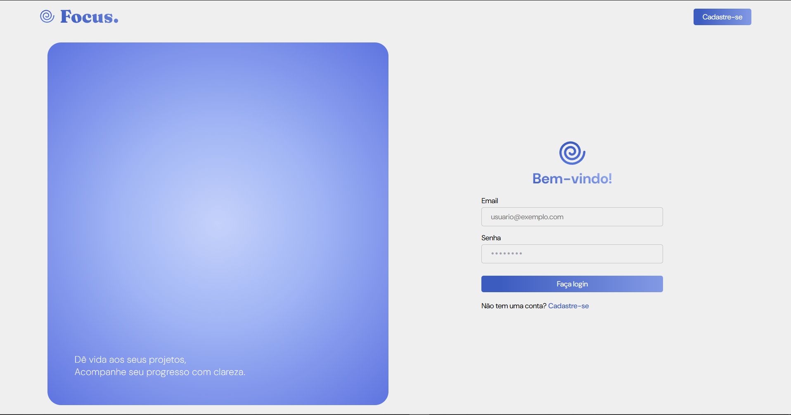
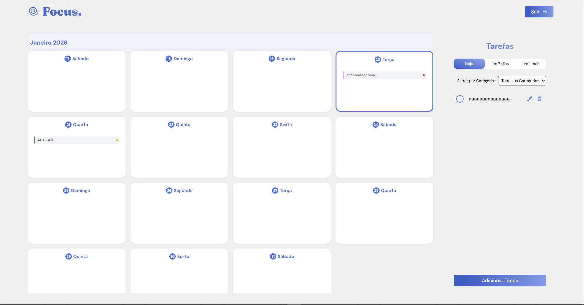

# Focus.

> Uma solução para gerenciamento de produtividade, projetada para oferecer controle sobre fluxos de trabalho pessoais com foco em performance e usabilidade.
<div align="center">
    
</div>
<p align="center">Figura 1: Logo da Aplicação.</p>


## Visão Geral

O **Focus** é uma aplicação web Fullstack desenvolvida para otimizar a organização de atividades diárias. O objetivo é permitir aos usuários planejar suas semanas e meses com eficiência.

## Funcionalidades

* **Dashboard Interativo:** Visualização macro de tarefas através de um calendário mensal dinâmico.
* **Filtragem Avançada:**
    * Categorização semântica (Trabalho, Pessoal, Estudos, etc.).
    * Segmentação temporal (Visão de Hoje, Próximos 7 dias, Próximo Mês).
* **Gestão de Ciclo de Vida (CRUD):** Criação, leitura, atualização e exclusão de tarefas.
* **Identidade Visual Dinâmica:** Sistema de cores baseado na categoria da tarefa para rápida identificação visual.
* **Autenticação e Segurança:** Controle de acesso via autenticação de usuário.

## Stack Tecnológico

A arquitetura foi desenhada separando as responsabilidades entre cliente e servidor:

**Frontend (Client-side):**
* **React.js:** Biblioteca principal para construção da interface reativa.
* **Sass:** Pré-processador CSS para estilização modular e escalável.
* **Bootstrap:** Framework para responsividade e componentes base.

**Backend (Server-side):**
* **Ruby on Rails:** Framework para construção da API RESTful.
* **PostgreSQL:** Sistema gerenciador de banco de dados relacional (SGBD) para persistência segura dos dados.

## UI/UX e Prototipagem

A concepção da interface priorizou a usabilidade e a clareza visual. O protótipo de alta fidelidade foi integralmente desenvolvido no **Figma**, servindo como base para o desenvolvimento do Frontend.

🔗 **[Acesse o Protótipo Interativo no Figma](https://www.figma.com/design/g0aW159G8m8V6K2bQxi6HA/focus.?node-id=18-1242&t=B3HVcu6wfylrwPFB-1)**

### Galeria do Projeto
> Abaixo alguns prints da aplicação.
<div align="center">
    
</div>
<p align="center">Figura 2: Página home da aplicação</p>
<br>

<div align="center">
    
</div>
<p align="center">Figura 3: Página de autenticação, onde é possível fazer login e cadastro.</p>
<br>

<div align="center">
    
</div>
<p align="center">Figura 4: Página principal, onde é possível acessar o calendário e gerenciar tarefas pessoais.</p>
<br>

## Modelagem de Dados

A modelagem de dados foi estruturada para garantir a integridade referencial e a escalabilidade do sistema. O esquema relacional suporta associações entre usuários, tarefas e categorias.

🔗 **[Ver Documentação Técnica da Modelagem](https://github.com/danielle-soaress/focus-todo/blob/main/_docs/modelagem_dados.md)**

## Como Executar o Projeto

Siga as instruções abaixo para configurar o ambiente de desenvolvimento local.

### Pré-requisitos
* Node.js e gerenciador de pacotes (NPM ou Yarn)
* Ruby e Ruby on Rails
* PostgreSQL instalado e rodando

### Passo a Passo

1.  **Clone o repositório**
    ```bash
    git clone https://github.com/danielle-soaress/focus-todo.git
    ```

2.  **Configuração do Frontend**
    ```bash
    cd frontend
    npm install
    npm run dev
    ```

3. **Configuração do Backend** (API)
   
    Entre na pasta do backend e instale as dependências:
    ```bash
    cd backend
    bundle install
    
    ```
    
    
    **Importante:** Antes de rodar o banco, crie um arquivo chamado `.env` na raiz da pasta `backend` com as seguintes configurações (você pode ajustar usuário/senha conforme seu banco local). Utilize o `.env.example` como base:
    ```env
    DB_USERNAME=postgres
    DB_PASSWORD=postgres
    DB_HOST=127.0.0.1
    DEVISE_JWT_SECRET_KEY=chave_secreta_para_desenvolvimento_123
    
    ```
    
    
    Crie o banco de dados, rode as migrações e inicie o servidor:
    ```bash
    rails db:create db:migrate
    rails s
    
    ```
    
    
    *A API estará disponível em `http://localhost:3000`.*

## Autora

Desenvolvido por **Danielle Soares**
*Graduanda em Engenharia de Software na Universidade de Brasília (UnB).*
