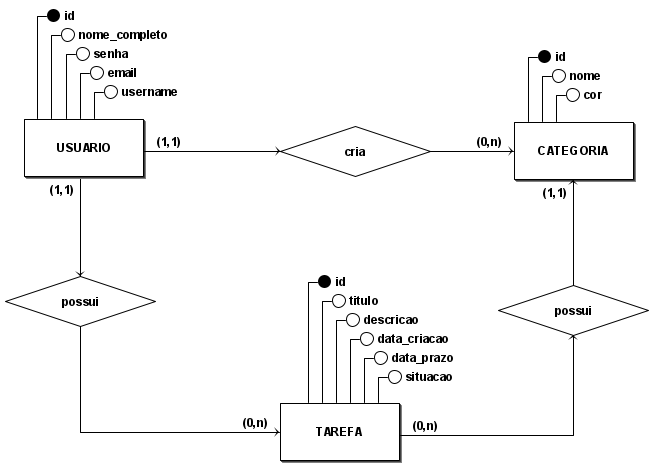
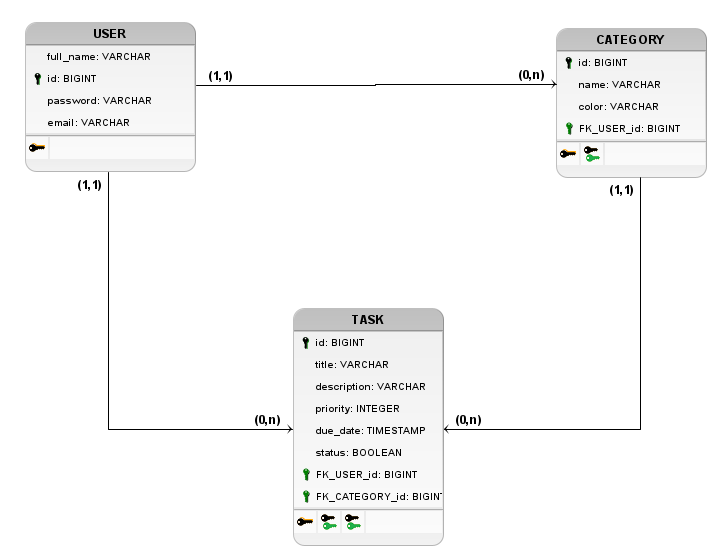

# Modelagem de Dados - Focus App

Este documento descreve a estrutura do banco de dados relacional (PostgreSQL) utilizado no projeto.

## 1. Diagrama de Entidade-Relacionamento (DER) - Nível Conceitual

 

O modelo baseia-se em três entidades principais, onde o Usuário é a entidade central que detém a posse tanto das Categorias quanto das Tarefas.

### 1.1. Entidades e Regras de Negócio

- **Usuário (User):** Representa a pessoa que utiliza o sistema.
- **Categoria (Category):** Representa os agrupamentos personalizados de tarefas (ex: Trabalho, Estudos).
- **Tarefa (Task):** A tarefa a ser realizada.

### 1.2. Relacionamentos

- **Usuário (1) -- cria -- (0,N) Categorias:** Um usuário pode criar múltiplas categorias. Uma categoria pertence a um único usuário, ou seja, são totalmente individuais e personalizáveis.
- **Usuário (1) -- possui -- (0,N) Tarefas:** Um usuário possui várias tarefas e uma tarefa pertence a um usuário.
- **Tarefa (0,N) -- possui (1) Categoria:** Uma categoria pode conter várias tarefas, mas uma tarefa deve pertencer a somente uma categoria.

## 2. Diagrama Lógico de Dados (DLD) - Nível Lógico

 

Abaixo está a definição detalhada das tabelas, tipos de dados e restrições.

### 2.1. Tabela: `users`
Armazena as informações de autenticação e perfil.

| Coluna | Tipo (Postgres) | Restrição | Descrição |
| :--- | :--- | :--- | :--- |
| **id** | `bigint` | **PK** | Identificador único universal. |
| `full_name` | `varchar(100)` | Not Null | Nome completo para exibição. |
| `email` | `varchar(100)` | Unique | E-mail para contato e login. |
| `password_digest` | `varchar` | Not Null | Hash da senha criptografada. |

### 2.2. Tabela: `categories`
Permite a organização das tarefas por contexto.

| Coluna | Tipo (Postgres) | Restrição | Descrição |
| :--- | :--- | :--- | :--- |
| **id** | `bigint` | **PK** | Identificador único universal. |
| `name` | `varchar(50)` | Not Null | Título da categoria (ex: "Trabalho"). |
| `color` | `varchar(6)` | Not Null | Código Hex da cor (ex: "#FF0000"). |
| `user_id` | `bigint` | **FK** | Referência ao dono da categoria (`users`). |

### 2.3. Tabela: `tasks`
O registro das atividades a serem realizadas.

| Coluna | Tipo (Postgres) | Restrição | Descrição |
| :--- | :--- | :--- | :--- |
| **id** | `bigint` | **PK** | Identificador único universal. |
| `title` | `varchar(200)` | Not Null | Título curto da tarefa com até 200 caracteres. |
| `description` | `text` | - | Detalhamento da tarefa (sem limite curto). |
| `status` | `boolean` | Default: False | Situação atual da tarefa (feita/não feita). |
| `due_date` | `timestamp` | - | Data e hora limite para conclusão. |
| `priority` | `integer` | Default: 0 (Low) | Prioridade da tarefa (0 - Low, 1 - Medium, 2 - High) |
| `user_id` | `bigint` | **FK** | Referência ao dono da tarefa (`users`). |
| `category_id` | `bigint` | **FK** | Referência à categoria (`categories`). |
